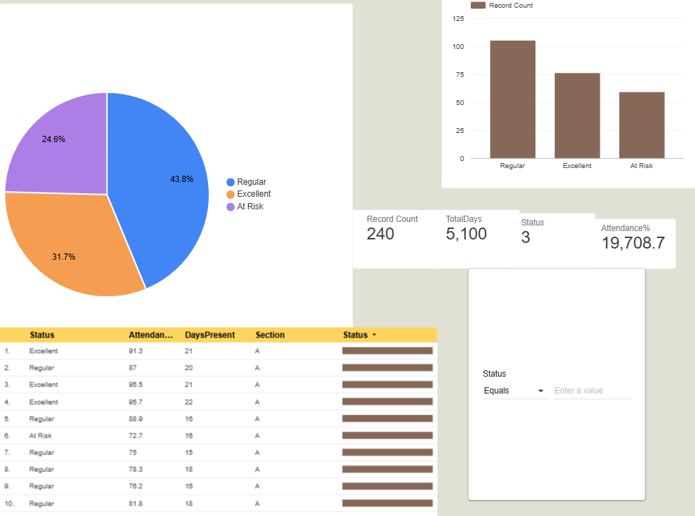

# Student Attendance Dashboard Section

## Overview

A comprehensive **Power BI dashboard** designed to track, analyze, and visualize student attendance data. This dashboard provides real-time insights into attendance patterns, trends, and key metrics for educational institutions.

---

## 📊 Dashboard Link

[Click here to view live dashboard](https://datastudio.google.com/s/rkLI4NVywOQ)

---

## 📸 Screenshots



---

## 📁 Data File

- **File Name:** `Student_Attendance_Data.csv`
- **Format:** CSV
- **Description:** Contains raw student attendance records including student ID, date, attendance status, and other relevant metrics

### Data Structure:
| Column | Description |
|--------|-------------|
| Student ID | Unique identifier for each student |
| Name | Student name |
| Date | Attendance date |
| Status | Present/Absent/Late |
| Class | Class/Grade |
| Section | Section/Division |

---

## 🎯 Features

- **Real-time Attendance Tracking** - Monitor attendance status instantly
- **Trend Analysis** - Visualize attendance patterns over time
- **Student Performance Metrics** - Track individual and class-wide attendance rates
- **Interactive Filters** - Filter by date range, class, section, and more
- **Visual Analytics** - Charts, graphs, and heatmaps for easy interpretation
- **Export Functionality** - Download reports in multiple formats

---

## 🛠️ Technologies Used

- **Power BI** - Dashboard creation and visualization
- **CSV** - Data storage format
- **DAX** - Data Analysis Expressions for calculations

---

## 📋 How to Use

1. **Access the Dashboard** - Click the dashboard link above
2. **Apply Filters** - Use the filter options to narrow down data by:
   - Date range
   - Student name
   - Class/Section
   - Attendance status
3. **Export Reports** - Download visualizations as PDF or image files
4. **Refresh Data** - Update the dashboard with the latest attendance records

---

## 📊 Key Metrics

- **Total Attendance Rate** - Overall percentage of present students
- **Class-wise Analysis** - Attendance breakdown by class
- **Attendance Trends** - Daily/weekly/monthly attendance patterns
- **Absent Students** - Students with low attendance records
- **Late Count** - Number of late arrivals by date

---

## 🔧 Setup Instructions

### Local Setup:

1. **Clone the repository:**
   ```bash
   git clone https://github.com/NavadeepCh/IAIP-Intern-Alpha-Internship-Project.git
   cd IAIP-Intern-Alpha-Internship-Project
   ```

2. **Import Data:**
   - Open Power BI Desktop
   - Select "Get Data" → "CSV"
   - Navigate to `Student_Attendance_Data.csv`
   - Load the data

3. **Open Dashboard:**
   - Open the Power BI project file (.pbix)
   - Refresh data to load the latest records

---

## 📈 Dashboard Components

### 1. Overview Section
- High-level KPIs (Key Performance Indicators)
- Total students, present count, absence count, late count
- Current month attendance rate

### 2. Trend Analysis
- Daily attendance line chart
- Weekly breakdown
- Month-over-month comparison

### 3. Class Performance
- Class-wise attendance comparison
- Section-wise analytics
- Top and bottom performing classes

### 4. Detailed View
- Student-level attendance records
- Individual attendance history
- Performance flags for at-risk students

---

## 📝 Project Structure

```
IAIP-Intern-Alpha-Internship-Project/
│
├── README.md                          # This file
├── Dashboard.pbix                     # Power BI dashboard file
├── screenshots/
│   └── Dashboard.png                  # Dashboard screenshot
├── data/
│   └── Student_Attendance_Data.csv   # Raw data file
└── docs/
    └── Documentation.md               # Detailed documentation
```

---

## 🎓 Learning Outcomes

This project demonstrates:
- Data visualization best practices
- Dashboard design principles
- Real-world data analysis
- Power BI proficiency
- Data interpretation and storytelling

---

## 📧 Submitted By

**Navadeep Ch**  
[GitHub Profile](https://github.com/NavdeepCh)  
[LinkedIn](https://linkedin.com/in/navadeepch)

---

## 🏢 Program

**Intern Alpha** - IAIP Internship Program

---

## 📄 License

This project is part of the IAIP Internship Program. All rights reserved.

---

## 🤝 Support & Feedback

For questions, feedback, or issues:
- Open an issue on [GitHub Issues](https://github.com/NavadeepCh/IAIP-Intern-Alpha-Internship-Project/issues)
- Contact: [navadeepch2005@gmail.com]

---

## ✅ Checklist for Completion

- [x] Dashboard created
- [x] Data file prepared
- [x] Screenshots captured
- [x] Documentation completed
- [ ] Dashboard published (update link above)
- [ ] Testing completed
- [ ] Final submission ready

---

**Last Updated:** June 2026  
**Status:** In Progress ✨
